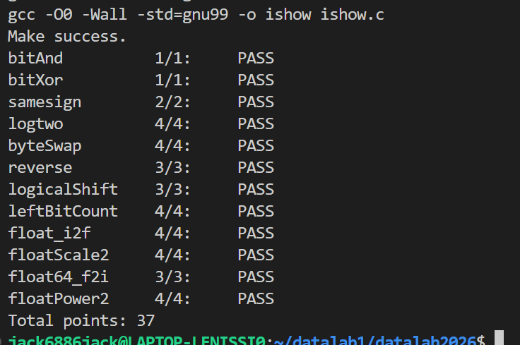

# datalab 报告

姓名：王烁杰

学号：2025201894

| 总分 | bitXor | logtwo | byteSwap | reverse | logicalShift | leftBitCount |
| ---- | ------ | ------ | -------- | ------- | ------------ | ------------ |
| 37   | 1      | 4      | 4        | 3       | 3            | 4            |

| float_i2f | floatScale2 | float64_f2i | floatPower2 | samesign | bitAnd |
| --------  | ----------- | ----------- | ----------- | -------- | ------ |
| 4         | 4           | 3           | 4           | 2        | 1      |

> 全部 12 个函数均通过正确性与合规性测试，满分 37/37。

test 截图（`make` 编译 + `test.py` 测试，全部函数 PASS，总分 37/37）：



## 解题报告

### 亮点

1. `reverse` —— 用 5 次「并行换位」完成 32 位逆序，思路最巧妙、操作数最省。
2. `logtwo` —— 用二分移位逐位累计出最高位位置，刻意兼容 `int` 变量，避开了 `(unsigned)`。
3. `float_i2f` —— 三个浮点题里复杂度最高，难点是「就近偶舍入」的进位处理。

### bitAnd

```c
int bitAnd(int x, int y) { return ~(~x | ~y); }
```

由德摩根律：`x & y = ~(~x | ~y)`。仅用 `~` 与 `|` 两次取反即可，无需其他操作符。

### bitXor

```c
int bitXor(int x, int y) { return (~(x & y)) & (~(~x & ~y)); }
```

异或可改写为 `(x | y) & ~(x & y)`，而 `x | y` 再次用德摩根律替换为 `~(~x & ~y)`，从而只用 `~` 与 `&` 两个操作符完成位异或。

### samesign

```c
int samesign(int x, int y) {
    if (x)
        if (y)
            if ((x >> 31) ^ (y >> 31)) return 0;
            else return 1;
        else return 0;
    else if (y) return 0;
    else return 1;
}
```

符号由最高位决定，`x >> 31` 取符号位。两个数异或符号位不同即为异号。难点在于题目规定 `0` 既非正也非负：只要其一为 0 而另一个非 0 就返回 0，只有两数同为 0 才返回 1，因此用 `if/else` 对 0 单独分流。

### logtwo

```c
int logtwo(int v) {
    int answer = 0, shift = 0;
    shift = ((v >> 16) > 0) << 4;  answer |= shift;  v >>= shift;
    shift = ((v >> 8)  > 0) << 3;  answer |= shift;  v >>= shift;
    shift = ((v >> 4)  > 0) << 2;  answer |= shift;  v >>= shift;
    shift = ((v >> 2)  > 0) << 1;  answer |= shift;  v >>= shift;
    shift = ((v >> 1)  > 0);       answer |= shift;
    return answer;
}
```

`log2 v` 的整数部分就是最高位 1 的位号（从 0 起）。用二分思想逐位确定：先看 v 高 16 位是否非 0，是则答案记 16 再右移 16；依次判断 8、4、2、1 位。每步的 `(v >> k) > 0` 等价于「剩余部分的最高位是否落在高 k 位内」，从而一位一位地累计出对数。整个解答刻意全部使用有符号 `int` 与右移/比较，避免依赖无符号右移。

### byteSwap

```c
int byteSwap(int x, int n, int m) {
    int check = 0x000000FF;
    n <<= 3;  m <<= 3;                    // 字节索引 → 位移量 (×8)
    int an = (x >> n) & check;            // 抠出第 n 字节
    int am = (x >> m) & check;            // 抠出第 m 字节
    int ans = x;
    ans ^= an << n;  ans ^= am << m;      // 清掉原两字节位段
    ans ^= an << m;  ans ^= am << n;      // 分别放回对方位置
    return ans;
}
```

利用异或的自反性 `a ^ a = 0`：先把两处原字节「抹掉」，再把 `an` 放到第 m 字节、`am` 放到第 n 字节。需要把 n、m 先 `<<3` 换算成字节移位量。

### reverse

```c
unsigned reverse(unsigned v) {
    v = (v >> 16 & 0x0000FFFF) + (v << 16 & 0xFFFF0000); // 交换 16 位两半
    v = (v >> 8  & 0x00FF00FF) + (v << 8  & 0xFF00FF00); // 内部交换 8 位
    v = (v >> 4  & 0x0F0F0F0F) + (v << 4  & 0xF0F0F0F0); // 交换 4 位
    v = (v >> 2  & 0x33333333) + (v << 2  & 0xCCCCCCCC); // 交换 2 位
    v = (v >> 1  & 0x55555555) + (v << 1  & 0xAAAAAAAA); // 交换相邻位
    return v;
}
```

经典的并行位逆序（斯坦福位运算技巧）：先整体交换高 16 位与低 16 位，再在每个 16 位内交换 8 位，依此类推，最后交换相邻位。每一步用掩码取低半、移位取高半再相加，5 步即可完成 32 位逆序，操作数远少于逐位循环。

### logicalShift

```c
int logicalShift(int x, int n) {
    int minus_1 = 0xFFFFFFFF;
    int answer = x >> n;                 // 算术右移，高位是符号扩展
    int check = !(!n) << 31;             // n>0 时为 0x80000000，n=0 时为 0
    check = ~(check >> (n + minus_1));   // 构造低 (32-n) 位为 1 的掩码
    return answer & check;
}
```

算术右移会在高位补符号位，逻辑右移要补 0。因此先把 `x >> n` 算好，再用掩码把符号扩展出来的高 n 位清零。掩码等价于 `~(0x80000000 >> (n-1))`，即高 n 位为 0、低 (32-n) 位为 1。`!(!n)` 用于区分 `n == 0` 不需遮罩的边界情况。

### leftBitCount

```c
int leftBitCount(int x) {
    int answer = 0, shift;
    shift = !((x & 0xFFFF0000) ^ 0xFFFF0000) << 4;  answer += shift;  x <<= shift;
    shift = !((x & 0xFF000000) ^ 0xFF000000) << 3;  answer += shift;  x <<= shift;
    shift = !((x & 0xF0000000) ^ 0xF0000000) << 2;  answer += shift;  x <<= shift;
    shift = !((x & 0xC0000000) ^ 0xC0000000) << 1;  answer += shift;  x <<= shift;
    shift = !((x & 0x80000000) ^ 0x80000000);        answer += shift;  x <<= shift;
    shift = !((x & 0x80000000) ^ 0x80000000);        answer += shift;
    return answer;
}
```

由最高位向低位统计连续 1。与 `logtwo` 同构：先判断最高 16 位是否全 1（`(x & mask) ^ mask` 为 0 说明这组位全为 1），是则计数加 16 并左移 16，再依次判断 8、4、2、1 位，最后两个单 bit 判断补足到满 32 位。

### float_i2f

```c
unsigned float_i2f(int x) {
    unsigned answer = 0, temp = x, cnt = 0;
    if (x < 0) { answer = 0x80000000; temp = -temp; }     // 符号位 + 取绝对值
    if (temp == 0) return answer;
    while (!(temp & 0x80000000)) { cnt++; temp <<= 1; }   // 左移规格化到最高位
    unsigned exp = (158 - cnt) << 23;
    if (cnt < 8) {                                        // 需要舍入的低位
        unsigned remove = (temp << 24) >> (cnt + 24), check = 1 << (7 - cnt);
        if ((remove > check) | ((remove == check) & ((temp & 0x00000100) != 0))) {
            temp += 0x00000100;                           // 加 0.5ulp 实现就近舍入
            if ((temp & 0xFFFFFF00) == 0) { temp = 0x80000000; exp += 0x00800000; }
        }
    }
    temp >>= 8;                                           // 右移取 23 位尾数
    return answer | (exp & 0x7F800000) | (temp & 0x007FFFFF);
}
```

int → float 的位级模拟，分四步：第一步记录符号、取绝对值；第二步循环左移规格化，`cnt` 记录移位数，从而得到规格化指数 `exp = (158 - cnt) << 23`；第三步对被移掉的低位做「就近偶舍入」（大于 0.5 进位，等于 0.5 看保留位奇偶，`temp & 0x100` 即预留的舍入保护位），若进位导致尾数溢出则尾数归 0.5、指数加 1；第四步组装 `sign | exp | frac`。

### floatScale2

```c
unsigned floatScale2(unsigned uf) {
    unsigned exp = (uf >> 23) & 0xFF, flag = uf >> 31, frac = uf & 0x007FFFFF;
    if (exp == 0xFF) return uf;              // NaN / Inf 原样返回
    if (exp == 0) return (uf << 1) | (flag << 31);  // 0 / 非规格数整体左移即 ×2
    exp++;
    if (exp == 255) frac = 0;                // 溢出为 Inf，清尾数
    return (flag << 31) | (exp << 23) | frac;
}
```

按 IEEE 754 规则：NaN/Inf（exp=0xFF）原样返回；非规格数与 0（exp=0）直接整体左移一位保持符号就是 ×2；规格数只需指数 +1，若 +1 后到 255 则溢出为 Inf。

### float64_f2i

```c
int float64_f2i(unsigned uf1, unsigned uf2) {
    unsigned exp = (uf2 >> 20) & 0x7FF, flag = uf2 >> 31;
    unsigned frac1 = uf2 & 0x000FFFFF, frac2 = uf1;
    int e = exp - 1023;
    if (e >= 31) return 0x80000000;   // 溢出
    if (e < 0) return 0;              // 下溢
    unsigned ans = ((frac1 | 0x00100000) << 11) | ((frac2 & 0xFFE00000) >> 21);
    ans = ans >> (31 - e);            // 见下方说明
    if (flag) ans = ~ans + 1;         // 负数取补码
    return ans;
}
```

double（高 32 位 `uf2` 含符号 + 11 位指数 + 尾数，低 32 位 `uf1`）向零取整转 int。取出真指数 `e = exp - 1023`；`e >= 31` 超界返回溢出码 `0x80000000`，`e < 0` 太小返回 0。否则拼出高位尾数（含隐式 1 的 52 位尾数中与结果相关的部分），右移 `31 - e` 提取整数位，负号则取补码。其中 `(frac1 | 0x00100000)` 补回规格化的隐式 1，再与 `frac2` 的高位拼接成整数位所需的位宽。

### floatPower2

```c
unsigned floatPower2(int x) {
    if (x > 127) return 0x7F800000;                    // 超界 → +INF
    if (x < -149) return 0;                            // 太小 → 0
    if ((x >= -149) & (x <= -127)) return 1 << (x + 149); // 非规格数
    return (x + 127) << 23;                            // 规格化：指数 = x+127
}
```

2 的幂没有尾数位。规格化数偏置指数为 `x + 127`；当 `x < -127` 转入非规格数区间（`-149 <= x <= -127`），用 `1 << (x + 149)` 表示落在尾数上的那条 1；`x > 127` 溢出为 +Inf，`x < -149` 小于最小非规格数则归 0。

## 反馈/收获/感悟/总结

- 耗时：约 2 个下午。复杂度集中在三个浮点题，尤其是 `float_i2f` 的舍入。
- 收获：最深的是「位运算可以表达任意基本逻辑」——`samesign` 对符号位异或、`logtwo`/`leftBitCount` 把二分查找压缩成移位累计、`reverse` 用分治并行换位，这些套路比逐位循环高效得多。
- 提示：合规性检查对操作数严格计数，调试时先用 `./btest` 验证正确性后再删 `printf` 跑 `test.py`，能少走很多弯路。

## 参考的重要资料

1. Randal E. Bryant, David R. O'Hallaron. 《深入理解计算机系统（CSAPP）》第 2 章"信息的表示与处理"。
2. Wikipedia. IEEE 754（单双精度浮点位级结构与舍入规则）— https://en.wikipedia.org/wiki/IEEE_754
3. Stanford. Bit Twiddling Hacks（并行位逆序 reverse 的直接来源）— https://graphics.stanford.edu/~seander/bithacks.html